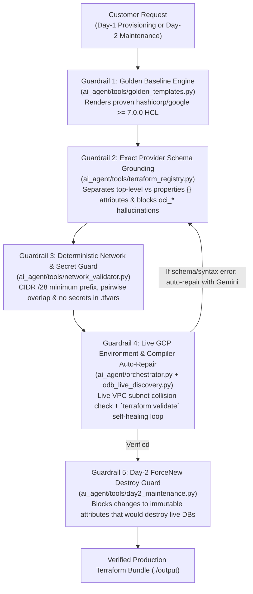

# Oracle Database@Google Cloud — Autonomous LLM Architect Agent (`oracle-google-ai-agent`)

[](https://ssh.cloud.google.com/cloudshell/editor?cloudshell_git_repo=https://github.com/sharmagauravji-goog/oracle-google-ai-agent&cloudshell_tutorial=cloudshell_tutorial.md)

A production-grade, **LLM-powered AI Architect Agent** for **Oracle Database@Google Cloud (ODB@GCP)** built on the official `google-genai` SDK (`gemini-3.8-flash` / `gemini-3.1-pro-preview`).

Designed for **external customers** to run in their own environments (**Google Cloud Shell**, local laptops, or corporate jump hosts) to **create (Day-1)** and **maintain/evolve (Day-2)** production Oracle@Google Terraform configurations with **5-layer anti-hallucination guardrails**.

---

## 1. The 5-Layer Anti-Hallucination Guardrail Pipeline

LLMs writing raw Terraform from memory frequently confuse **OCI Terraform provider** resources (`oci_database_*`) with **Google Cloud Terraform provider** resources (`google_oracle_database_*`), or misplace nested `properties {}` attributes. This agent enforces a 5-layer deterministic verification loop:



---

## 2. Easiest Customer Setup Options

### Path 1: 1-Click Google Cloud Shell (Recommended — Zero Install, Zero API Keys)
Google Cloud Shell comes pre-installed with `gcloud` (already logged in), `terraform`, `python3`, and `git`.
1. Click the **Open in Cloud Shell** button at the top of this README (or clone the repo inside Cloud Shell).
2. Cloud Shell automatically walks you through [`cloudshell_tutorial.md`](./cloudshell_tutorial.md) using your active GCP project's Vertex AI Application Default Credentials (`location="global"`).

### Path 2: Local Virtual Environment (`venv` + `gcloud` ADC or `GEMINI_API_KEY`)
```bash
# 1. Create and activate virtual environment
python3 -m venv .venv
source .venv/bin/activate
.venv/bin/pip install --upgrade pip
.venv/bin/pip install -r requirements.txt
.venv/bin/pip install -e .

# 2A. Connect via Vertex AI ADC (Enterprise Default — Zero API Keys)
gcloud auth application-default login
export GOOGLE_CLOUD_PROJECT="your-gcp-project-id"
export GOOGLE_CLOUD_LOCATION="global"

# 2B. Or connect via Gemini Developer API Key
# export GEMINI_API_KEY="your-google-ai-studio-api-key"

# 3. Verify environment & live LLM handshake
odb-ai-agent doctor --ping-llm
```

### Path 3: Single-Command Docker Container
```bash
docker compose up --build odb-ai-agent-web
# Open http://127.0.0.1:8502
```

---

## 3. CLI & Web Studio Usage (Day-1 Creation & Day-2 Maintenance)

### Generate a Verified Golden Terraform Bundle (Day-1)
```bash
# Generates versions.tf, variables.tf, networking.tf, workload.tf, outputs.tf, terraform.tfvars
# Runs CIDR /28 + overlap checks, anti-hallucination schema checks, and `terraform validate`
odb-ai-agent generate-golden \
  --project-id my-odb-project-01 \
  --workload adb \
  --region us-east4 \
  --oracle-zone us-east4-b-r1 \
  --vpc-cidr 10.10.0.0/16 \
  --client-cidr 10.20.1.0/24
```

### Inspect an Existing Workspace for Safe Day-2 Maintenance
```bash
# Inventories existing .tf files, audits deletion_protection = true,
# and lists safe in-place scaling attributes vs. immutable ForceNew replacement attributes
odb-ai-agent inspect-day2 --workspace-dir ./output/odb-golden-bundle
```

### Interactive AI Architect Chat & Single-Shot Queries
```bash
# Multi-turn terminal chat with live tool execution trace & post-generation HCL auto-repair
odb-ai-agent chat

# Single-shot request
odb-ai-agent ask "Generate a Golden Exascale Terraform configuration in us-east4 and verify that 10.20.1.0/24 does not overlap with existing subnets."
```

### Launch the Streamlit AI Agent Studio
```bash
streamlit run ai_agent/web.py --server.address=127.0.0.1 --server.port=8502
```

---

## 4. Running the Test Suite

```bash
.venv/bin/pytest -v
```
