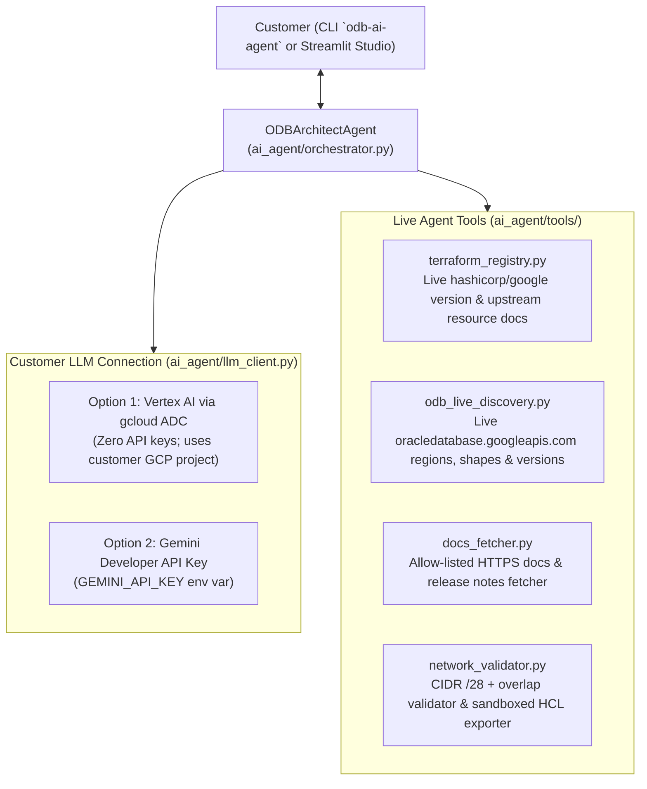

# Oracle Database@Google Cloud — Autonomous LLM Architect Agent (`oracle-google-ai-agent`)

A standalone, **LLM-powered AI Architect Agent** for **Oracle Database@Google Cloud (ODB@GCP)** built on the official `google-genai` SDK (`gemini-3.8-flash` / `gemini-3.1-pro-preview`).

Unlike the static wizard in `oracle-google-onboarding-agent`, this agent uses **live tool calling** to dynamically inspect:
1. **Live Terraform Provider Releases & Resource Schemas** (`registry.terraform.io` + upstream `hashicorp/terraform-provider-google` markdown docs for `google_oracle_database_*`).
2. **Live Google Cloud Oracle Database API Capabilities** (`oracledatabase.googleapis.com/v1` for live regions, `gcp_oracle_zone` identifiers, `dbSystemShapes`, `giVersions`, and `autonomousDbVersions`).
3. **Live Official Documentation & Release Notes** (allow-listed HTTPS fetcher for `cloud.google.com/oracle/database/docs` and `docs.oracle.com`).
4. **Deterministic Network & Terraform Guardrails** (CIDR `/28` minimum prefix check, pairwise overlap verification, `terraform validate` sandbox, and path-traversal-safe bundle export).

---

## 1. Architecture Overview



---

## 2. How a Customer Connects the Downloaded Agent to LLMs

### Option A: Vertex AI via `gcloud` ADC (Recommended for Enterprise GCP Customers — Zero API Keys)
Because customers deploying Oracle Database@Google Cloud already have a Google Cloud project and the `gcloud` CLI, the agent can authenticate directly through **Application Default Credentials (ADC)**:

```bash
# 1. Log in with Google Cloud ADC
gcloud auth application-default login

# 2. Ensure the Vertex AI API is enabled in your project
gcloud services enable aiplatform.googleapis.com --project=YOUR_GCP_PROJECT_ID

# 3. Export your project settings
export ODB_AGENT_AUTH_MODE="vertex"
export GOOGLE_CLOUD_PROJECT="YOUR_GCP_PROJECT_ID"
export GOOGLE_CLOUD_LOCATION="us-central1"
```

### Option B: Gemini Developer API Key (Fastest for Local Evaluation)
For quick local testing without enabling Vertex AI in a GCP project:

```bash
export ODB_AGENT_AUTH_MODE="api_key"
export GEMINI_API_KEY="your-google-ai-studio-api-key"
```

---

## 3. Quick Start

```bash
# 1. Create and activate virtual environment
python3 -m venv .venv
source .venv/bin/activate

# 2. Install dependencies
.venv/bin/pip install --upgrade pip
.venv/bin/pip install -r requirements.txt
.venv/bin/pip install -e .
```

### Verify Environment & LLM Connection (`doctor`)
```bash
# Check gcloud, Terraform Registry connectivity, and configured LLM credentials
odb-ai-agent doctor

# Send a live test handshake to Gemini
odb-ai-agent doctor --ping-llm
```

### Inspect Live Terraform Provider & Resource Schemas (No LLM Key Required)
```bash
# List latest hashicorp/google version and all ODB resources
odb-ai-agent inspect-provider

# Fetch live upstream documentation for a specific resource
odb-ai-agent inspect-provider --resource google_oracle_database_exadb_vm_cluster
```

### Run the Interactive Terminal Agent (`chat` or `ask`)
```bash
# Multi-turn interactive architect chat with live tool execution trace
odb-ai-agent chat

# Single-shot question or Terraform generation request
odb-ai-agent ask "Check the latest hashicorp/google provider version and generate Terraform for an Oracle 23ai Autonomous Database in us-east4 with VPC 10.10.0.0/16 and Client Subnet 10.20.1.0/24."
```

### Launch the Streamlit AI Agent Studio
```bash
streamlit run ai_agent/web.py --server.address=127.0.0.1 --server.port=8502
```

---

## 4. Running Tests

```bash
.venv/bin/pytest -v
```
